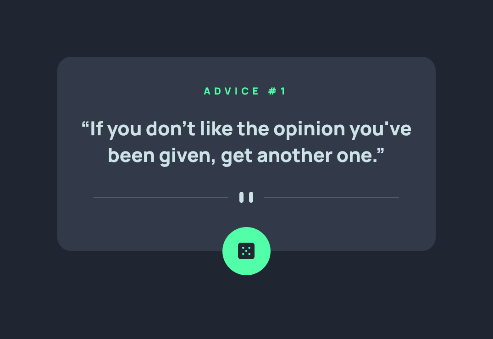

# Frontend Mentor - Advice generator app solution

This is a solution to the [Advice generator app challenge on Frontend Mentor](https://www.frontendmentor.io/challenges/advice-generator-app-QdUG-13db). Frontend Mentor challenges help you improve your coding skills by building realistic projects.

## Table of contents

- [Overview](#overview)
  - [The challenge](#the-challenge)
  - [Screenshot](#screenshot)
  - [Links](#links)
- [My process](#my-process)
  - [Built with](#built-with)
  - [What I learned](#what-i-learned)
  - [Useful resources](#useful-resources)
- [Author](#author)
- [Acknowledgments](#acknowledgments)

## Overview

### The challenge

Users should be able to:

- View the optimal layout for the app depending on their device's screen size
- See hover states for all interactive elements on the page
- Generate a new piece of advice by clicking the dice icon

### Screenshot

### Links

- Solution URL: [https://github.com/SuperJulia2024/frontendmentor-Advice-generator-app](https://github.com/SuperJulia2024/frontendmentor-Advice-generator-app)
- Live Site URL: [https://superjulia2024.github.io/frontendmentor-Advice-generator-app](https://superjulia2024.github.io/frontendmentor-Advice-generator-app)

## My process

### Built with

- Semantic HTML5 markup
- CSS custom properties
- Flexbox
- Mobile-first workflow
- Javascript
- jQuery

### What I learned

How to make a request to an API and fetch a JSON response
Then, how to set the values in the right boxes

### Useful resources

- [jQuery - Click event](https://api.jquery.com/click/) 
- [Using the Fetch API](https://developer.mozilla.org/en-US/docs/Web/API/Fetch_API/Using_Fetch) 

## Author

- Frontend Mentor - [@SuperJulia2024](https://www.frontendmentor.io/profile/SuperJulia2024)

## Acknowledgments

Thanks to FrontEndMentor for this amazing challenge
